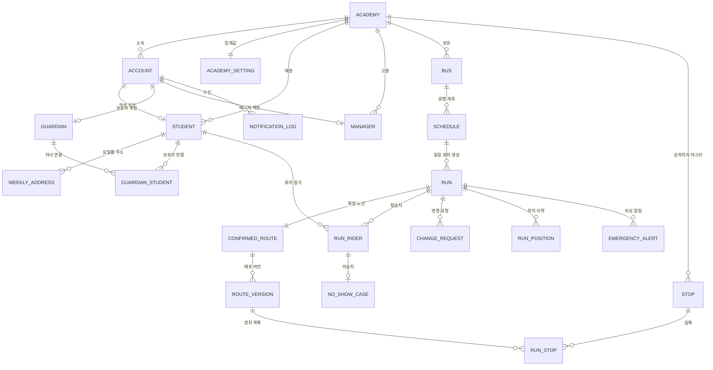
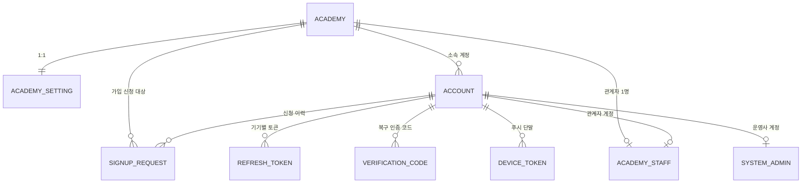
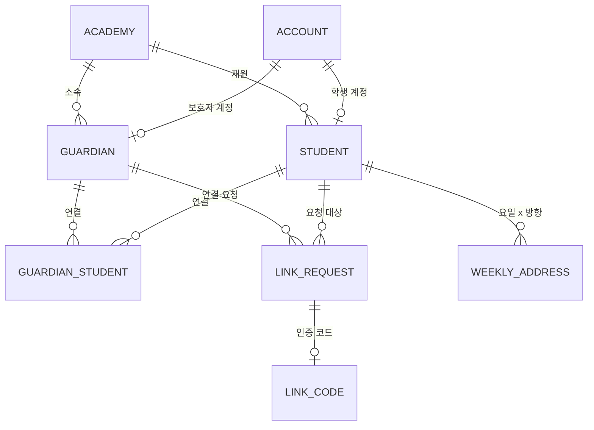
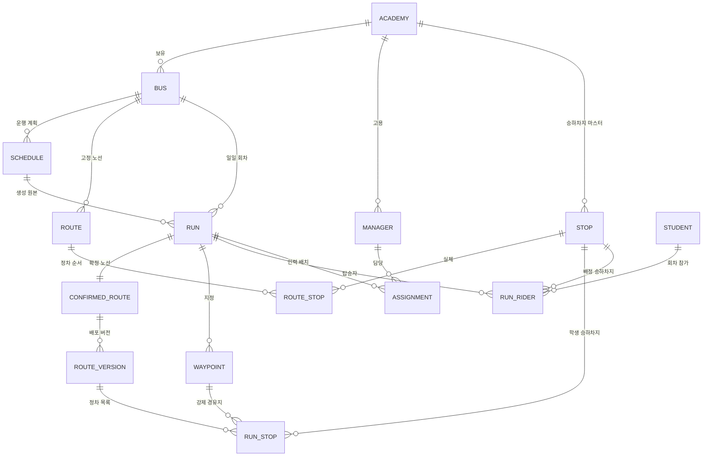
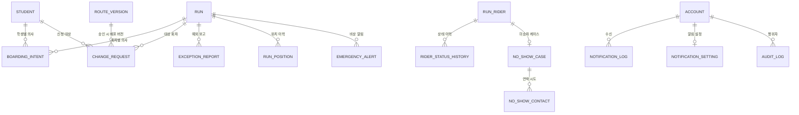

# 바래다 (BARAEDA) — ERD

학원 통학버스 운행·학생 등하원 관리 플랫폼의 **데이터 모델 설계서**. 테이블 · 컬럼 · 관계 · 제약 · 인덱스를 담음.

| 항목 | 내용 |
|---|---|
| 문서 버전 | v1.0 |
| 작성일 | 2026-08-24 |
| 기준 | FEATURE_SPEC.md · PRD.md · USER_FLOWS.md · API_SPEC.md v1.0 (2026-08-24) |
| DBMS | PostgreSQL |
| 성격 | **To-Be 설계** — 현 코드베이스의 실측 기록 부재. 구현은 이 문서에 맞춰 갱신 대상 |

**자매 문서** — [FEATURE_SPEC.md](./FEATURE_SPEC.md) · [PRD.md](./PRD.md) · [USER_FLOWS.md](./USER_FLOWS.md) · [API_SPEC.md](./API_SPEC.md) · [ARCHITECTURE.md](./ARCHITECTURE.md) · [TECH_DECISIONS.md](./TECH_DECISIONS.md)

## 0. 문서 경계 · 표기 규칙

| 문서 | 담는 것 | 담지 않는 것 |
|---|---|---|
| **ERD.md** (이 문서) | 테이블 · 컬럼 · 타입 · 관계 · 제약 · 인덱스 · 격리 · 보존 정책 | 모듈 구조, 파이프라인, 배포, 정책 근거, 상태값의 의미 |
| `FEATURE_SPEC.md` | 공통 규칙 C-01~C-17, 상태머신, 계층별 기능 정의 | 물리 스키마 |
| `PRD.md` | 정책 채택 근거, 우선순위, NFR | 물리 스키마 |
| `API_SPEC.md` | 엔드포인트 계약, enum 사전 | 물리 스키마 |

**상태값 목록을 이 문서에 복제하지 않음** — `run.status` · `run_rider.status` · `change_request.status` 등의 값과 의미는 `API_SPEC §9 enum 사전`과 `FEATURE_SPEC §3` 이 정의처이며, 여기서는 컬럼의 CHECK 목록으로만 인용.

**표기**

| 기호 | 뜻 |
|---|---|
| `PK` | 기본 키 |
| `FK` | 외래 키 — DB 제약을 실제로 설정하는 관계 (§4 에서 설정 여부를 구분) |
| `UK` | 유니크 제약 |
| `NN` | NOT NULL |
| 🆕 | 사양 4종에 대응 서술이 부재하고 **설계 판단으로 추가한 테이블·컬럼** |

**공통 규약**

| 항목 | 규칙 |
|---|---|
| 명명 | 테이블·컬럼 `snake_case`, 테이블은 **단수형** (`student` · `run_rider`) |
| PK | 전 테이블 `id bigint generated always as identity`. 예외는 1:1 확장 테이블(부모 PK 를 그대로 PK 로 사용) |
| 시각 | 전부 `timestamptz`. 기준 시간대 `Asia/Seoul` (API_SPEC §1.1) |
| 날짜·시각 분리 | 운행일은 `date`, 스케줄의 시각 원본은 `time`, 실제 발생 시각은 `timestamptz` |
| 좌표 | `lat` · `lng` `numeric(9,6)` (API_SPEC §1.1 — WGS84 소수점 6자리) |
| enum | `varchar(n)` + CHECK 목록. 값은 API_SPEC §9 표기와 글자 그대로 일치 |
| 감사 컬럼 | 생성 시각 컬럼을 전 테이블에 두되 **의미가 명확한 이름을 우선**(`requested_at` · `sent_at` · `occurred_at` 등), 그 외에는 `created_at timestamptz NN default now()`. 수정이 발생하는 테이블에만 `updated_at` 추가 |

---

## 1. 전체 구조 — 도메인 그룹

39개 테이블을 4개 그룹으로 분할. 아래 소계는 §3 의 테이블 정의를 직접 센 값이며 2026-08-24 신설 3개(`verification_code` 그룹 ② · `device_token`·`emergency_alert` 그룹 ④)가 포함된 기준.

| 그룹 | 테이블 수 | 범위 |
|---|:-:|---|
| ① 학원 · 계정 · 권한 | 7 | 테넌트, 로그인 계정, 가입 승인, 토큰 |
| ② 학생 · 보호자 · 주소 | 7 | 학생 레코드, 보호자 연결, 요일별 승하차 주소, 인증 코드 |
| ③ 차량 · 인력 · 운행 · 노선 | 13 | 차량, 매니저, 스케줄, 회차, 고정·확정 노선, 승하차지, 탑승자 |
| ④ 요청 · 예외 · 알림 · 이력 | 12 | 탑승 의사, 변경 요청, 미승차, 예외 보고, 위치, 알림, 단말, 감사 |

⚠ **이 표의 소계는 §3 의 `####` 항목 수와 일치해야 함.** 2026-08-25 이전 판이 7·6·13·10(=36)으로 어긋나 있었고, 신설 테이블의 소속 그룹 서술도 실제 정의 위치와 달랐음. 테이블을 더하거나 옮기면 이 표를 함께 고침.

### 1.1 그룹 간 연결 개요

---

## 2. 그룹별 ERD

### 2.1 ① 학원 · 계정 · 권한

컬럼은 §3.1 이 정의처 — 다이어그램은 관계만 표기.

### 2.2 ② 학생 · 보호자 · 주소

컬럼은 §3.2 이 정의처.

### 2.3 ③ 차량 · 인력 · 운행 · 노선

컬럼은 §3.3 이 정의처. **노선 3종의 저장 위치** — 고정 노선 = `route` + `route_stop`, 확정 노선 = `confirmed_route` + `route_version` + `run_stop`, 실시간 노선 = 확정 노선의 현재 버전에 `run_stop.change='skipped'` 를 반영한 조회 결과(별도 테이블 부재).

### 2.4 ④ 요청 · 예외 · 알림 · 이력

컬럼은 §3.4 가 정의처. 이 그룹의 `run_position` · `notification_log` · `audit_log` · `exception_report` · `rider_status_history` · `emergency_alert` **6개는 FK 미설정** — 근거는 §4.2.

---

## 3. 엔티티별 상세

### 3.1 그룹 ① — 학원 · 계정 · 권한

#### `academy` — 학원

| 컬럼 | 타입 | 제약 | 설명 |
|---|---|---|---|
| `id` | bigint | PK | 내부 식별자. 소속 연결의 기준 — 학원 코드 변경이 기존 가입자에 무영향인 근거 |
| `code` | varchar(32) | UK NN | 학원 코드. **서버 자동 생성** — 관리자 입력 부재. 가입 검색 대상 (ACAD-02) |
| `name` | varchar(100) | NN | 학원명 |
| `region` | varchar(50) | NN | 지역(시·군·구). 동명 학원 구분값 |
| `address` | varchar(255) | | 학원 주소 |
| `contact` | varchar(30) | | 대표 연락처. 승인 대기 화면의 `academy_contact` |
| `memo` | text | | 운영사 내부 메모 |
| `status` | varchar(10) | NN | `active` · `inactive`. CHECK |
| `created_at` · `updated_at` | timestamptz | NN | |

**존재 이유** — 멀티테넌시의 최상위 단위이자 가입 시 사용자가 선택하는 대상. **근거** ACAD-01~04 · O-01 · C-01

#### `academy_setting` 🆕 — 학원별 임계값

| 컬럼 | 타입 | 제약 | 설명 |
|---|---|---|---|
| `academy_id` | bigint | PK FK | `academy.id` 를 그대로 PK 로 사용 — 1:1 |
| `no_show_wait_minutes` 🆕 | integer | NN default 3 | 미승차 대기 카운트다운. **3분**이 기본값이며 학원별 설정 대상 |
| `created_at` · `updated_at` | timestamptz | NN | |

**존재 이유** — 정책 상수 중 유일하게 "학원별 설정"으로 규정된 미승차 대기 시간을 담을 자리. 나머지 9개 상수는 전역 값이라 컬럼 부재 (FEATURE_SPEC §2.1). **근거** EXC-01 · FEATURE_SPEC §2.1 · M-13

#### `account` — 로그인 계정

| 컬럼 | 타입 | 제약 | 설명 |
|---|---|---|---|
| `id` | bigint | PK | API 의 `account_id` |
| `academy_id` | bigint | FK | 소속 학원. `role=system_admin` 은 NULL — 학원 격리의 판정 근거 (API_SPEC §1.5) |
| `login_id` | varchar(50) | UK NN | 로그인 아이디. 중복 시 `409 DUPLICATE_LOGIN_ID` |
| `password_hash` | varchar(255) | NN | 해시 저장 |
| `name` | varchar(50) | NN | 이름 |
| `phone` | varchar(30) | NN | 연락처. 아이디·비밀번호 복구의 인증 수단 (AUTH-08) |
| `email` | varchar(120) | | 관계자 계정 수정 대상에만 등장하는 값 (API_SPEC §6.7) |
| `role` | varchar(20) | NN | `parent` · `student` · `driver` · `escort` · `staff` · `system_admin`. CHECK |
| `status` | varchar(10) | NN | `pending` · `active` · `rejected` · `blocked`. CHECK |
| `failed_attempts` | integer | NN default 0 | 로그인 연속 실패 횟수. **5회** 도달 시 `blocked` (C-11) |
| `blocked_at` | timestamptz | | 차단 일시 |
| `block_reason` | varchar(100) | | 차단 사유 — 차단 목록의 `reason` |
| `unblocked_by` | bigint | | 해제 처리자 계정. 이력 요건 (AUTH-06 · API_SPEC §6.12) |
| `unblocked_at` | timestamptz | | 해제 일시 (API_SPEC §6.12) |
| `last_login_at` | timestamptz | | 관계자 계정 목록의 표시값 (API_SPEC §6.7) |
| `created_at` · `updated_at` | timestamptz | NN | |

**존재 이유** — 전 인원이 form 가입으로 만드는 단일 인증 주체. 역할·상태가 접근 범위를 결정. **근거** C-01 · C-11 · AUTH-01~09 · API_SPEC §1.4

#### `signup_request` — 회원가입 승인 요청

| 컬럼 | 타입 | 제약 | 설명 |
|---|---|---|---|
| `id` | bigint | PK | API 의 `request_id` |
| `account_id` | bigint | FK NN | 신청 계정 |
| `academy_id` | bigint | FK NN | 신청 학원. 재신청 시 새 행이 생기며 학원이 달라질 가능성 존재 |
| `requested_role` | varchar(20) | NN | 신청 역할. `staff` 는 메인 관리자 큐로 분리 |
| `approver_type` | varchar(20) | NN | `staff` · `system_admin`. 가입 응답의 `approver` |
| `status` | varchar(10) | NN | `pending` · `accepted` · `rejected`. CHECK |
| `requested_at` | timestamptz | NN | 신청 일시 |
| `decided_by` | bigint | | 처리자 계정 |
| `decided_at` | timestamptz | | 처리 시각 |
| `reject_reason` | varchar(200) | | 거절 사유. 거절 시 필수 (애플리케이션 검증) |

**존재 이유** — 계정 생성과 활성화를 분리하는 승인 큐. 재신청이 새 행을 쌓아 처리 이력이 남음. **근거** AUTH-01·03·10 · ACAD-05 · C-01

#### `academy_staff` — 학원 관계자

| 컬럼 | 타입 | 제약 | 설명 |
|---|---|---|---|
| `id` | bigint | PK | |
| `academy_id` | bigint | FK NN | |
| `account_id` | bigint | FK UK NN | 계정 1:1 |
| `status` | varchar(10) | NN | `active` · `inactive`. 퇴사 시 즉시 권한 회수 |
| `created_at` · `updated_at` | timestamptz | NN | |

**존재 이유** — 학원당 1명 정원을 DB 레벨에서 강제하는 자리. 이름·연락처는 `account` 가 보유하고 여기서 중복 보관 부재. **근거** C-01 · ACAD-05·06 · O-02 · A-01

#### `system_admin` — 메인 관리자

| 컬럼 | 타입 | 제약 | 설명 |
|---|---|---|---|
| `id` | bigint | PK | |
| `account_id` | bigint | FK UK NN | 계정 1:1. 내부 발급 — 가입 경로 부재 |
| `created_at` | timestamptz | NN | |

**존재 이유** — 전 학원 범위 권한 보유자의 명시적 등록부. `account.role` 만으로도 판정 가능하나, 발급 사실을 별도 레코드로 남겨 무단 역할 변경을 관측 가능하게 유지. **근거** FEATURE_SPEC §1.2 · §3.2 · O-01~06

#### `refresh_token` 🆕 — 장기 토큰

| 컬럼 | 타입 | 제약 | 설명 |
|---|---|---|---|
| `id` | bigint | PK | |
| `account_id` | bigint | FK NN | |
| `token_hash` 🆕 | varchar(255) | UK NN | 원문 미저장 |
| `issued_at` 🆕 | timestamptz | NN | 발급 시각 |
| `expires_at` 🆕 | timestamptz | NN | 만료 시각 |
| `revoked_at` 🆕 | timestamptz | | 무효화 시각 — 로그아웃 · 계정 차단 · 비밀번호 변경 |
| `device_label` 🆕 | varchar(100) | | 기기 식별 라벨 |

**존재 이유** — refresh 토큰의 무효화가 요건인데(로그아웃 · 차단 · 비밀번호 변경 시 전량 무효화) 서버가 발급분을 보관하지 않으면 무효화 판정 수단이 부재. **근거** C-14 · API_SPEC §1.2 · §2.7 · §2.8

**클라이언트 종류(앱·웹) 구분 컬럼을 두지 않음** — 전달 수단이 갈리는 것은 HTTP 요청 시점의 판정이고(쿠키 존재 여부 · `X-Client-Type`), 저장하는 것은 어느 쪽이든 같은 토큰. 구분이 필요한 운영 용도는 `device_label` 로 충분. 근거 API_SPEC §1.2.1 · TECH_DECISIONS §2.4

---

### 3.2 그룹 ② — 학생 · 보호자 · 주소

#### `student` — 학생

| 컬럼 | 타입 | 제약 | 설명 |
|---|---|---|---|
| `id` | bigint | PK | |
| `academy_id` | bigint | FK NN | |
| `account_id` | bigint | FK UK | 학생 계정. 가입 승인 시 연결되며 그 전에는 NULL (AUTH-11) |
| `name` | varchar(50) | NN | |
| `student_phone` | varchar(30) | | 학생 연락처. 관제 화면에서 원문 노출 (C-13 · O-06) |
| ~~`guardian_phone`~~ | — | — | **컬럼 부재.** 보호자 연락처는 `guardian_student` → `guardian` → `account.phone` 으로 조회 (A-10). 학생에 복제하면 보호자가 번호를 바꿔도 명단이 옛 값을 계속 보여줌. 계정 미연결 학생은 연락처가 비어 있는 것이 정상이며 그 상태를 관계자 화면이 드러냄 |
| `photo_url` | varchar(255) | | 사진. **육안 확인 전용**, 얼굴인식 부재. 학부모·학생 앱 응답에 미반환 |
| `gender` | varchar(10) | | `male` · `female`. CHECK |
| `birth_date` | date | | 생년월일 |
| `grade` | varchar(20) | | 나이(학년) |
| `class_name` | varchar(50) | | 반 |
| `seat_no` | integer | | 좌석 배정 |
| `note` | text | | 특이사항 (STU-07) |
| `can_go_alone` | boolean | NN default false | 혼자 귀가 가능 여부. 하원 하차 판단 근거 (STU-08) |
| `deleted_at` | timestamptz | | 퇴원 soft delete — **오늘 명단은 유지**, 내일 회차부터 제외 (STU-04) |
| `created_at` · `updated_at` | timestamptz | NN | |

**존재 이유** — 노선·명단·알림이 모두 참조하는 중심 레코드. 계정보다 먼저 생성되며 계정 연결은 승인 시점. **근거** STU-01~08 · A-10 (연락처·승하차 주소는 관계자 입력 대상 밖 — 2026-08-24 확정) · AUTH-11

#### `guardian` — 보호자

| 컬럼 | 타입 | 제약 | 설명 |
|---|---|---|---|
| `id` | bigint | PK | |
| `academy_id` | bigint | FK NN | |
| `account_id` | bigint | FK UK NN | 보호자 계정 1:1 |
| `name` | varchar(50) | NN | |
| `phone` | varchar(30) | NN | 연락처 |
| `created_at` · `updated_at` | timestamptz | NN | |

**존재 이유** — 자녀 N명 연결의 기준점. `student_id` 를 직접 부착하지 않고 연결 테이블로만 표현. **근거** FEATURE_SPEC §3.2 · P-02 · ATT-03

#### `guardian_student` — 보호자 ↔ 학생 연결

| 컬럼 | 타입 | 제약 | 설명 |
|---|---|---|---|
| `id` | bigint | PK | |
| `guardian_id` | bigint | FK NN | |
| `student_id` | bigint | FK NN | |
| `linked_at` | timestamptz | NN | 연결 시각 |
| `unlinked_at` 🆕 | timestamptz | | 퇴원 시 연결 해제 — 과거 이력은 보존 (UF-P-01) |

**존재 이유** — 다자녀를 재가입 없이 연결 추가로 처리하는 유일 경로. 학부모 API 의 접근 범위 판정(연결된 자녀만) 근거. **근거** P-02 · ATT-03 · API_SPEC §1.5

#### `link_request` 🆕 — 자녀 연결 요청

| 컬럼 | 타입 | 제약 | 설명 |
|---|---|---|---|
| `id` | bigint | PK | API 의 `link_request_id` |
| `guardian_id` 🆕 | bigint | FK NN | 요청한 보호자 |
| `student_id` 🆕 | bigint | FK NN | 요청 대상 학생. `student_login_id` 로 조회한 결과 |
| `requested_at` 🆕 | timestamptz | NN | |
| `expires_at` 🆕 | timestamptz | NN | 요청 만료 시각 |
| `status` 🆕 | varchar(10) | NN | `pending` · `completed` · `expired`. CHECK |

**존재 이유** — 연결은 **요청(보호자) → 코드 생성(학생) → 코드 입력(보호자)** 3단계이며, 첫 단계가 자체 식별자와 만료 시각을 반환하므로 코드와 별개 레코드가 필요. **근거** P-02 · S-05 · API_SPEC §3.2

#### `verification_code` 🆕 — 아이디·비밀번호 복구 인증 코드

| 컬럼 | 타입 | 제약 | 설명 |
|---|---|---|---|
| `id` | bigint | PK | |
| `phone` | varchar(20) | NN | 인증 대상 전화번호 |
| `code` | varchar(10) | NN | 발급 코드 |
| `purpose` | varchar(20) | NN | `login_id` · `password`. CHECK. **값은 `POST /auth/recover` 의 `type` 과 동일한 리터럴** — 같은 개념에 값을 두 벌 두면 변환표가 필요하고, 그 변환표가 어디에도 없으면 구현 시점에 처음 드러남 (API_SPEC §2.9 · §9) |
| `expires_at` | timestamptz | NN | 만료 시각 |
| `consumed_at` | timestamptz | | 사용 시각. NULL 이면 미사용 |
| `attempt_count` | integer | NN default 0 | 대조 시도 횟수 |
| `created_at` | timestamptz | NN default now() | |

**존재 이유** — `POST /auth/recover` 가 SMS 인증 코드를 받고 `403 VERIFICATION_CODE_INVALID` 로 **만료·불일치**를 판정하므로 서버가 발급분을 보관해야 판정이 성립. `link_code` 와 같은 이유이며 대상(전화번호 ↔ 학생 계정)과 용도만 다름. **근거** AUTH-08 · API_SPEC §2.9 · §8.1

#### `link_code` — 자녀 연결 인증 코드

| 컬럼 | 타입 | 제약 | 설명 |
|---|---|---|---|
| `id` | bigint | PK | |
| `link_request_id` | bigint | FK NN | 대응 요청 |
| `code` | varchar(10) | NN | 학생 앱이 생성한 인증 코드 |
| `expires_at` | timestamptz | NN | 만료 시각 |
| `used_at` | timestamptz | | 사용 시각. 재사용 차단 근거 |
| `created_at` | timestamptz | NN | |

**존재 이유** — 코드 대조를 **서버가** 수행하는 전제라 발급분을 서버가 보관. 만료·불일치는 동일하게 `403 LINK_CODE_INVALID`. **근거** P-02 · S-05 · API_SPEC §3.3

#### `weekly_address` — 요일별 등하원 주소

| 컬럼 | 타입 | 제약 | 설명 |
|---|---|---|---|
| `id` | bigint | PK | |
| `student_id` | bigint | FK NN | |
| `weekday` | varchar(3) | NN | `mon`~`sun`. CHECK |
| `direction` | varchar(20) | NN | `to_academy` · `from_academy`. CHECK |
| `address` | varchar(255) | NN | 주소 원문 |
| `address_detail` | varchar(255) | | 아파트 동·출입구 등 상세 위치 |
| `lat` · `lng` | numeric(9,6) | | 검증으로 변환된 좌표 |
| `verified` | boolean | NN default false | 주소 검증 통과 여부. 실패 시 **저장 보류**라 `false` 행이 남지 않는 것이 정상 경로 |
| `stop_id` 🆕 | bigint | FK | 검증 후 매칭·생성된 승하차지 (STU-05) |
| `updated_at` | timestamptz | NN | |

**존재 이유** — **기본 주소 개념이 부재**하고 요일 × 방향이 노선 산출의 유일한 기준이라 조합마다 독립 행이 필요. **근거** P-05 · STU-05·06 · C-12 · C-16

---

### 3.3 그룹 ③ — 차량 · 인력 · 운행 · 노선

#### `bus` — 차량

| 컬럼 | 타입 | 제약 | 설명 |
|---|---|---|---|
| `id` | bigint | PK | |
| `academy_id` | bigint | FK NN | |
| `bus_no` | varchar(20) | NN | 호차 |
| `plate_no` | varchar(20) | NN | 차량번호 |
| `capacity` | integer | NN | 승차 정원 |
| `driver_count` 🆕 | integer | NN default 1 | 정원에서 제외할 기사 수 |
| `escort_count` 🆕 | integer | NN default 1 | 정원에서 제외할 동승자 수 |
| `student_capacity` | integer | NN | 학생 탑승 가능 인원 = `capacity` − `driver_count` − `escort_count`. CHECK 로 계산식 강제 |
| `operable` | boolean | NN default true | 운행 가능 여부 |
| `created_at` · `updated_at` | timestamptz | NN | |

**존재 이유** — 정원 초과 차단의 기준값 보유. `student_capacity` 는 응답 전용 자동 계산이나, 검증이 매 요청 재계산에 의존하지 않도록 컬럼으로 고정하고 CHECK 로 정합성 유지. **근거** BUS-01~04 · A-11

#### `manager` — 운행인력

| 컬럼 | 타입 | 제약 | 설명 |
|---|---|---|---|
| `id` | bigint | PK | |
| `academy_id` | bigint | FK NN | |
| `account_id` | bigint | FK UK | 가입 승인 시 연결. 연결 전 NULL (AUTH-11) |
| `name` | varchar(50) | NN | |
| `phone` | varchar(30) | NN | 관제 화면에서 원문 노출 (O-05) |
| `role` | varchar(10) | NN | `driver` · `escort`. **이 값이 앱 권한을 결정**. CHECK |
| `work_hours` | jsonb | | 근무 시간. 배치 충돌 검증 근거 (MGR-06). **구조화된 시간 범위**(요일 × 시작·종료)를 담고 자유 텍스트를 두지 않음 — 텍스트면 충돌 검증이 불가 (2026-08-24 확정) |
| `deleted_at` | timestamptz | | soft delete. 배치 중이면 삭제 차단 (MGR-04) |
| `created_at` · `updated_at` | timestamptz | NN | |

**존재 이유** — 기사·동승자를 한 테이블로 두고 `role` 로 가르는 구조. 승하차 처리 권한(동승자 전용)의 판정 근거. **근거** MGR-01~06 · C-06 · A-12

#### `schedule` — 운행 스케줄

| 컬럼 | 타입 | 제약 | 설명 |
|---|---|---|---|
| `id` | bigint | PK | |
| `academy_id` | bigint | FK NN | |
| `bus_id` | bigint | FK NN | |
| `weekday` | varchar(3) | NN | `mon`~`sun`. CHECK |
| `direction` | varchar(20) | NN | `to_academy` · `from_academy`. CHECK |
| `depart_time` | time | NN | 출발 시각의 원본. 회차 생성 시 `service_date` 와 합쳐 `timestamptz` 로 확정 |
| `origin_name` · `destination_name` | varchar(100) | NN | 출발지 · 도착지. 운행 카드의 표시값 |
| `est_duration_min` | integer | | 예상 소요시간(분) |
| `active` | boolean | NN default true | 비활성 스케줄은 회차 미생성 |
| `created_at` · `updated_at` | timestamptz | NN | |

**존재 이유** — 일일 회차 자동 생성의 원본. 휴원·특강은 `run` 쪽 임시 조정으로 처리하고 **정규 스케줄은 불변**이라 이 테이블에 예외일 컬럼 부재. **근거** SCH-01~03 · A-09

#### `run` — 일일 운행 회차

| 컬럼 | 타입 | 제약 | 설명 |
|---|---|---|---|
| `id` | bigint | PK | API 의 `run_id` |
| `academy_id` | bigint | FK NN | 대시보드·관제가 학원 범위로 직접 조회 |
| `bus_id` | bigint | FK NN | |
| `schedule_id` | bigint | FK | 생성 원본. 임시 추가 회차는 NULL |
| `service_date` | date | NN | 운행일 |
| `direction` | varchar(20) | NN | `to_academy` · `from_academy`. CHECK |
| `depart_time` | timestamptz | NN | 출발 시각. **3구간 판정의 기준** |
| `confirm_at` | timestamptz | NN | 확정 예정 시각 = `depart_time` − **30분**. 배치 조회 대상 판정에 사용 |
| `status` | varchar(10) | NN | `idle` · `confirmed` · `moving` · `finished`. CHECK |
| `origin_name` · `destination_name` | varchar(100) | NN | 운행 카드 표시값 |
| `est_duration_min` | integer | | 예상 소요시간(분) |
| `confirmed_at` | timestamptz | | 확정 배치가 실제로 실행된 시각. 지연 실행 추적 근거 (PRD §5.2) |
| `started_at` | timestamptz | | 운행 시작 시각 |
| `finished_at` | timestamptz | | 종료 시각 |
| `finish_pending` | boolean | NN default false | 하원 최종 도착 처리 후 미하차 잔류로 종료 보류 중 |
| `canceled_at` | timestamptz | | 임시 취소 (SCH-03) |
| `created_at` · `updated_at` | timestamptz | NN | |

**존재 이유** — 3구간 판정 · 확정 배치 · 명단 · 위치 · 알림이 전부 매달리는 중심 축. `confirm_at` 을 파생값이 아니라 컬럼으로 고정한 이유는 배치가 **"실행 시각이 지난 회차"** 를 매 실행마다 조회하기 때문 (§5 인덱스 참조). **근거** SCH-02 · RTE-02 · RUN-02·04·05 · C-04 · C-15

#### `route` — 고정 노선

| 컬럼 | 타입 | 제약 | 설명 |
|---|---|---|---|
| `id` | bigint | PK | |
| `academy_id` | bigint | FK NN | |
| `bus_id` | bigint | FK NN | |
| `weekday` | varchar(3) | NN | 요일별 주소가 기준이라 요일 단위로 분리. CHECK |
| `direction` | varchar(20) | NN | `to_academy` · `from_academy`. CHECK |
| `name` | varchar(100) | | 편성 이름 |
| `active` | boolean | NN default true | |
| `created_at` · `updated_at` | timestamptz | NN | |

**존재 이유** — 학기 단위로 유지되는 편성. 확정 노선과 **별개 레코드**로 두어 당일 변경이 원본을 오염시키지 않게 분리. 확정 전 학부모·기사 화면이 표시하는 "확정 전" 노선의 출처. **근거** C-03 · RTE-01 · A-08 · P-08

#### `route_stop` 🆕 — 고정 노선의 정차 순서

| 컬럼 | 타입 | 제약 | 설명 |
|---|---|---|---|
| `id` | bigint | PK | |
| `route_id` 🆕 | bigint | FK NN | |
| `stop_id` 🆕 | bigint | FK NN | 승하차지 마스터 |
| `seq` 🆕 | integer | NN | 정차 순번 |

**존재 이유** — 고정 노선이 "편성·최적화" 대상이라 순서를 가진 목록이 필요하고, 확정 노선의 정차 목록(`run_stop`)과 수명 주기가 달라 같은 테이블에 수용 불가. **근거** RTE-01 · A-08 · P-08(확정 전 고정 노선 표시)

#### `confirmed_route` — 회차별 확정 노선

| 컬럼 | 타입 | 제약 | 설명 |
|---|---|---|---|
| `run_id` | bigint | PK FK | 회차 1:1 |
| `current_version_id` | bigint | FK | 현재 배포 중인 버전. 명단·운행 화면이 읽는 기준 |
| `confirmed_at` | timestamptz | NN | 확정 배치 산출 시각 |
| `created_at` · `updated_at` | timestamptz | NN | |

**존재 이유** — 회차와 노선 버전 목록을 잇는 자리이자 "지금 유효한 버전"의 단일 지시자. 이 포인터가 없으면 매 조회가 최신 버전 계산에 의존. **근거** C-03 · RTE-02 · UF-X-05

#### `route_version` 🆕 — 확정 노선 배포 버전

| 컬럼 | 타입 | 제약 | 설명 |
|---|---|---|---|
| `id` | bigint | PK | |
| `confirmed_route_id` 🆕 | bigint | FK NN | |
| `version_no` 🆕 | integer | NN | 1 기점 증가. 승인 응답의 `route_version` |
| `source` 🆕 | varchar(20) | NN | `confirm_batch` · `approval` · `waypoint` · `transfer`. 재배포를 유발한 조작. CHECK. **`forced_add` 부재** — 강제 추가는 ①구간 전용(A-06)이고 확정 배치는 30분 전에 돌므로 그 시점에 `confirmed_route` 자체가 미존재 |
| `est_duration_min` 🆕 | integer | | 재최적화 결과 예상 소요시간 |
| `est_distance_km` 🆕 | numeric(6,2) | | 재최적화 결과 총 운행 거리 |
| `published_at` 🆕 | timestamptz | | 배포 시각. NULL 이면 **미리보기 전용** 버전 |
| `input_fingerprint` 🆕 | varchar(64) | NN | 산출 입력(대상 명단 · 승하차지 좌표 · 경유 지점)의 해시. 승인 시점에 재계산해 대조하고 불일치면 `409 PREVIEW_STALE` (API_SPEC §5.5·§5.6) |
| `engine_name` 🆕 | varchar(30) | NN | 순서 최적화 전략 식별자. 알고리즘 교체 시 어느 산출물인지 판별 |
| `policy_snapshot` 🆕 | jsonb | NN | 산출 시점 정책값. 정책이 바뀌어도 과거 노선을 재현·설명 가능 |
| `fallback_used` 🆕 | boolean | NN default false | 지도 API 폴백(직선거리 근사)으로 계산됐는지. 품질 저하분 식별 |
| `created_by` 🆕 | bigint | | 배포 유발 계정 |
| `created_at` | timestamptz | NN | |

**존재 이유** — ②구간 승인·경유 지점 지정이 확정 노선을 **재최적화 후 재배포**하고 응답이 배포된 노선 버전을 반환하므로, 배포 단위를 식별할 레코드가 필요. 승인 화면의 `stops_before[]` / `stops_after[]` 대조도 두 버전의 `run_stop` 비교로 성립. 미리보기(`apply=false`)는 `published_at` NULL 버전으로 산출하고 배포 시에만 `current_version_id` 를 전진. **근거** A-05 · A-15 · REQ-04 · RTE-10 · API_SPEC §5.6 · §5.15

#### `stop` — 승하차지 마스터

| 컬럼 | 타입 | 제약 | 설명 |
|---|---|---|---|
| `id` | bigint | PK | |
| `academy_id` | bigint | FK NN | 매칭 범위는 학원 안 |
| `name` | varchar(100) | NN | 표시명 (`중앙로 스타빌딩 앞`) |
| `address` | varchar(255) | NN | 주소 원문 |
| `lat` · `lng` | numeric(9,6) | NN | 검증으로 변환된 좌표 |
| `created_at` · `updated_at` | timestamptz | NN | |

**존재 이유** — 학생 등록·주소 수정 시 "주소 검증 → 승하차지 매칭 또는 신규 생성"이 회차 생성 이전에 발생하므로, 회차와 무관하게 존속하는 마스터가 필요. **공용 정류장 개념 부재**와 상충하지 않음 — 같은 주소를 쓰는 학생이 한 승하차지로 묶이는 것은 매칭 결과이지 정류장 편성이 아님. **근거** STU-05 · C-12 · UF-M-03·06

#### `run_stop` 🆕 — 회차 노선의 정차 항목

| 컬럼 | 타입 | 제약 | 설명 |
|---|---|---|---|
| `id` | bigint | PK | **API 경로의 `{stopId}`** 가 가리키는 값. 버전마다 새 행이라 배포가 일어나면 값이 바뀜 |
| `route_version_id` 🆕 | bigint | FK NN | 소속 버전. 재배포마다 새 행 집합 생성 |
| `stop_id` | bigint | FK | 학생 승하차지. 경유 지점이면 NULL |
| `waypoint_id` 🆕 | bigint | FK | 강제 경유지. 학생 승하차지면 NULL |
| `seq` | integer | NN | 운행 순번. `skipped` 여도 재부여 부재 |
| `change` | varchar(10) | | `added` · `skipped`. NULL = 변경 부재. CHECK |
| `skip_notice` | varchar(200) | | 미경유 안내 문구 |
| `arrived_at` | timestamptz | | 기사 도착 처리 타임스탬프. 중복 처리 차단의 판정값 |
| `eta` | timestamptz | | 승하차지별 도착 예정 시각. **관제 전용** — 학부모·학생 응답에 미포함 |

**존재 이유** — 순번·변경 구분·도착 시각은 **버전마다 달라지는 값**이라 승하차지 마스터에 보관 불가. 학생 승하차지와 강제 경유지가 같은 순번 열에 섞이므로 두 참조를 한 테이블에서 배타적으로 보유. **근거** C-05 · C-12 · RTE-05·10 · RUN-04 · RST-01 · O-05

#### `waypoint` 🆕 — 강제 경유 지점

| 컬럼 | 타입 | 제약 | 설명 |
|---|---|---|---|
| `id` | bigint | PK | API 의 `waypoint_id` |
| `run_id` 🆕 | bigint | FK NN | 대상 회차 |
| `label` | varchar(100) | NN | 기사 화면 표시명 |
| `address` | varchar(255) | | 주소 입력 방식. 좌표 미전달 시 필수 |
| `lat` · `lng` | numeric(9,6) | NN | 지도 선택 방식 또는 주소 검증 결과 |
| `note` | varchar(200) | | 경유 사유·특이사항 |
| `applied` | boolean | NN default false | 배포 완료 여부. `false` = 미리보기 단계 |
| `created_by` 🆕 | bigint | NN | 지정한 관계자 계정 |
| `created_at` | timestamptz | NN | |
| `removed_at` 🆕 | timestamptz | | 배포 후 제거 시각 — 제거도 미리보기 → 배포 절차를 거침 |

**존재 이유** — 학생 주소로 표현되지 않는 경유 요구(학원 사정 · 도로 통제 · 임시 집결지)를 담는 단위. 강제 추가(학생 단위)와 달리 **탑승자 없이 경유만** 필요한 경우가 대상. **근거** RTE-10 · A-15 · API_SPEC §5.15

#### `run_rider` — 회차별 탑승자

| 컬럼 | 타입 | 제약 | 설명 |
|---|---|---|---|
| `id` | bigint | PK | API 의 `rider_id` |
| `run_id` | bigint | FK NN | |
| `student_id` | bigint | FK NN | |
| `stop_id` | bigint | FK NN | 그날 이 학생의 승하차지. **버전이 바뀌어도 불변**이라 `run_stop` 이 아니라 마스터를 참조 |

⚠ **식별자 공간이 둘이라는 점을 응답 조립에서 흡수한다.** `run_rider.stop_id` 는 마스터(`stop.id`)이고 API 경로의 `{stopId}` 는 `run_stop.id` 다. 학생 노선 조회(API_SPEC §3.10)가 `my_stop_id` 와 `stops[].stop_id` 를 함께 반환하면 클라이언트가 대조할 수 없으므로, **서버가 마스터 → 현재 버전 `run_stop` 으로 변환한 뒤 같은 공간의 값만 내보낸다**. 강제 경유지 행은 `stop_id` 가 NULL 이라 마스터 식별자로 지목 불가한 것이 이 변환이 필요한 이유.
| `status` | varchar(10) | NN | `waiting` · `boarded` · `alighted` · `absent` · `no_show`. CHECK |
| `change` | varchar(10) | | `added` · `removed`. NULL = 변경 부재. CHECK |
| `note` | text | | 당일 비고 |
| `seat_no` | integer | | 좌석 |
| `boarded_at` | timestamptz | | 승차 시각 |
| `alighted_at` | timestamptz | | 하차 시각 |
| `changed_at` | timestamptz | | 마지막 상태 변경 시각 |
| `created_at` · `updated_at` | timestamptz | NN | |

**존재 이유** — 탑승 상태 5종이 학부모 푸시 · 관계자 현황 · 알림 로그 3곳에 동시 반영되는 값의 저장처. 명단 집계(`boarded` · `waiting` · `no_show` · `absent`)의 단위. **근거** C-02 · C-06 · C-07 · RST-02·04 · BRD-01~04

#### `assignment` — 회차별 매니저 배치

| 컬럼 | 타입 | 제약 | 설명 |
|---|---|---|---|
| `id` | bigint | PK | |
| `run_id` | bigint | FK NN | |
| `manager_id` | bigint | FK NN | |
| `role` | varchar(10) | NN | `driver` · `escort`. 회차당 역할별 1명. CHECK |
| `assigned_at` | timestamptz | NN | |
| `assigned_by` | bigint | | 배치 처리 계정 |
| `acked_route_version_id` 🆕 | bigint | FK | 확인 응답을 마친 노선 버전 |
| `acked_at` | timestamptz | | 변경 확인 응답 시각. 미확인 판정 = 이 값이 NULL 이거나 `current_version_id` 와 불일치 |

**존재 이유** — 매니저 앱의 회차 접근 범위 판정("배치된 회차만")과 대시보드의 `ack_driver` · `ack_escort` 표시의 근거. 확인 응답을 **버전과 함께** 기록하지 않으면 재배포 후에도 확인 완료로 남는 오판이 발생. **근거** MGR-05·06 · RUN-07 · MON-05 · API_SPEC §1.5

---

### 3.4 그룹 ④ — 요청 · 예외 · 알림 · 이력

#### `boarding_intent` — 회차별 탑승 의사

| 컬럼 | 타입 | 제약 | 설명 |
|---|---|---|---|
| `id` | bigint | PK | |
| `run_id` | bigint | FK NN | |
| `student_id` | bigint | FK NN | |
| `riding` | boolean | NN default true | 탑승 함/안 함. **기본값 ON** |
| `change_used_count` | integer | NN default 0 | ②구간 사용 횟수. 한도 **회차당 1회** — `change_quota_left = 1 − change_used_count` |
| `applied_segment` 🆕 | smallint | | 마지막으로 반영된 구간 1·2·3. ③구간 미등원(`applied_no_reroute`)과 ①구간 즉시 반영을 사후 구분 — `run_stop.change='skipped'` 만으로는 운행 중 미승차와 섞임 (C-04 ③ · C-05) |
| `changed_at` | timestamptz | | 마지막 토글 시각 |
| `changed_by` | bigint | | 토글한 학부모 계정 |
| `created_at` | timestamptz | NN | |

**존재 이유** — 확정 배치가 읽는 입력 두 축(일일 승하차지 · 금일 탑승 의사) 중 하나. 한도 소진 여부를 요청 테이블 집계가 아니라 컬럼으로 들고 있어야 **서버 처리 실패 시 횟수 미소진**을 트랜잭션 안에서 되돌리기 쉬움.

⚠ **`change_used_count` 는 두 경로가 함께 올린다** — 탑승 토글(ATT-01 · `PATCH .../intent`)과 일일 변경(REQ-01·02 · `POST .../change-requests`)이 같은 회차의 한도 1회를 공유하므로, 어느 경로로 들어오든 그 `(run_id, student_id)` 행의 카운터를 갱신. 요청 테이블별로 따로 세면 한 회차에 2회가 통과. **근거** ATT-01·02 · REQ-01·02 · C-04 · C-16 · C-10

#### `change_request` — 변경 요청 · 승인 대기

| 컬럼 | 타입 | 제약 | 설명 |
|---|---|---|---|
| `id` | bigint | PK | API 의 `change_request_id`. 승인 화면의 `approval_id` 와 동일 대상 |
| `academy_id` | bigint | FK NN | 관계자 승인 대기 목록이 학원 범위로 직접 조회 |
| `run_id` | bigint | FK NN | 대상 회차 |
| `student_id` | bigint | FK NN | |
| `source` | varchar(20) | NN | `intent`(등하원 토글) · `change_request`(일일 스케줄 변경). CHECK |
| `type` | varchar(10) | NN | `relocate` · `cancel`. CHECK |
| `status` | varchar(15) | NN | `pending` · `approved` · `rejected` · `auto_rejected`. CHECK |
| `window_segment` 🆕 | smallint | NN | 접수 시점의 구간 1 · 2 · 3. 사후 감사에서 판정 근거를 재현 |
| `new_address` | varchar(255) | | `type=relocate` 의 변경 주소 |
| `new_lat` · `new_lng` | numeric(9,6) | | 검증 결과 좌표 |
| `new_stop_id` 🆕 | bigint | FK | 검증 후 매칭·생성된 승하차지 |
| `reason` | varchar(200) | | 신청 사유 |
| `requested_by` | bigint | NN | 신청 학부모 계정 |
| `requested_at` | timestamptz | NN | |
| `deadline_at` | timestamptz | | 승인 마감 = 회차 출발 시각. 운행이 먼저 시작되면 그 시점이 실제 마감 |
| `decided_by` | bigint | | 처리 관계자 계정. 자동 거절은 NULL |
| `decided_at` | timestamptz | | 처리 시각 |
| `reject_reason` | varchar(200) | | 거절 사유 |
| `stop_removed` | boolean | | 승인 결과 해당 승하차지가 노선에서 제거됐는지 |
| `applied_route_version_id` 🆕 | bigint | FK | 승인으로 배포된 노선 버전 |

**존재 이유** — ②구간 승인 큐의 실체이자 **책임 소재 기록**(누가·언제·무엇을·자동 거절 여부·배포된 노선 버전). 토글(`intent`)과 일일 변경(`change_request`)이 같은 승인 화면·같은 한도를 공유하므로 한 테이블에 `source` 로 구분해 담음. **근거** REQ-01~05 · A-05 · C-04 · API_SPEC §3.6 · §5.5 · §5.6

#### `rider_status_history` 🆕 — 승하차 상태 변경 이력

| 컬럼 | 타입 | 제약 | 설명 |
|---|---|---|---|
| `id` | bigint | PK | |
| `run_rider_id` 🆕 | bigint | NN | 대상 탑승자. **FK 미설정** (§4) |
| `from_status` 🆕 | varchar(10) | | 이전 상태 |
| `to_status` 🆕 | varchar(10) | NN | 반영 상태 |
| `is_revert` 🆕 | boolean | NN default false | 되돌리기 여부 |
| `reason` 🆕 | varchar(200) | | 되돌리기 사유 |
| `verify_method` | varchar(10) | | `photo` · `manual`. CHECK |
| `client_key` | uuid | UK | 오프라인 큐 멱등키. 재수신 시 최초 결과 반환 |
| `occurred_at` | timestamptz | | 단말 기록 시각. 오프라인 처리분의 실제 시각 |
| `changed_at` | timestamptz | NN | 서버 반영 시각 |
| `actor_type` 🆕 | varchar(10) | NN | `escort` · `system`. 자동 전이(하원 시작 시 전원 `boarded` · 등원 종료 시 전원 `alighted` · `absent` 부여)의 주체를 구분. CHECK |
| `changed_by` 🆕 | bigint | | 처리한 동승자 계정. `actor_type='system'` 이면 NULL |

**존재 이유** — 되돌리기가 **이력 보존 전제**이며 "원 상태 · 정정 상태 · 처리자 · 시각"을 저장하도록 규정. 멱등키의 보관처도 이 테이블이라 재전송 판정이 상태 컬럼 비교가 아니라 키 조회로 성립. **근거** BRD-05 · BRD-06 · API_SPEC §1.7 · UF-E-06·07 · NFR-05·07

#### `no_show_case` — 미승차 에스컬레이션 케이스

| 컬럼 | 타입 | 제약 | 설명 |
|---|---|---|---|
| `id` | bigint | PK | API 의 `case_id` |
| `run_rider_id` | bigint | FK UK NN | 탑승자 1:1 — `no_show` 는 종결 상태라 회차당 1건 |
| `started_at` | timestamptz | NN | 발생 시각 |
| `expires_at` | timestamptz | NN | 대기 만료 = `started_at` + `academy_setting.no_show_wait_minutes` |
| `resolved_at` | timestamptz | | 학부모 응답 도착 등으로 카운트다운 중단된 시각 |
| `decision` | varchar(10) | | `depart` · `retry` — **케이스의 최종 판단**. 여러 연락 시도 뒤 관계자가 확정한 값이며 시도별 판단은 `no_show_contact.decision`. CHECK |
| `escalated_at` | timestamptz | | 관계자 보고 시각. NULL 이면 **에스컬레이션 누락**(KPI 목표 0건)의 후보 |
| `created_at` | timestamptz | NN | |

**존재 이유** — 미승차 대응의 시각을 남겨 "이력 부재 · 대응 시각 미기록" 문제를 해소. 대기 만료를 컬럼으로 고정한 이유는 학원별 설정값이 이후 바뀌어도 **발생 당시 기준**이 재현돼야 하기 때문. **근거** EXC-01 · M-13 · C-02 · PRD §9 KPI

#### `no_show_contact` 🆕 — 미승차 연락 시도

| 컬럼 | 타입 | 제약 | 설명 |
|---|---|---|---|
| `id` | bigint | PK | |
| `no_show_case_id` 🆕 | bigint | FK NN | |
| `attempt_type` | varchar(10) | NN | `call` · `message`. CHECK |
| `result` | varchar(10) | NN | `answered` · `no_answer`. CHECK |
| `decision` | varchar(10) | | `depart` · `retry` |
| `attempted_at` 🆕 | timestamptz | NN | 시도 시각 |
| `attempted_by` 🆕 | bigint | NN | 시도한 동승자 계정 |

**존재 이유** — 연락 시도가 **복수 회** 발생하고 각 시도의 결과가 카운트다운 중단 판정에 쓰이므로 케이스에 1:N 로 매달림. **근거** EXC-01 · API_SPEC §4.8 · UF-E-03

#### `emergency_alert` 🆕 — 비상 알림

| 컬럼 | 타입 | 제약 | 설명 |
|---|---|---|---|
| `id` | bigint | PK | |
| `academy_id` | bigint | NN | 학원 범위 조회 대상. **FK 미설정** (§4) |
| `run_id` | bigint | NN | 대상 회차. **FK 미설정** (§4) |
| `bus_no` | varchar(20) | NN | 호차 스냅샷 |
| `raised_by` | bigint | NN | 발신자 계정. **기사·동승자 둘 다 가능** (EXC-04) |
| `raised_by_role` | varchar(20) | NN | `driver` · `escort` — 발신 시점 역할 스냅샷 |
| `type` | varchar(20) | NN | `accident` · `vehicle_fault` · `student_emergency` · `etc`. CHECK |
| `memo` | text | | 상황 메모. `type='etc'` 이면 필수 |
| `lat` · `lng` | numeric(9,6) | | **발신 시점 위치**. 미전달 시 최신 수신 좌표로 대체 |
| `rider_count` | integer | NN | 발신 시점 탑승자 수 스냅샷 |
| `occurred_at` | timestamptz | NN | 단말 기록 시각 — **사고 시점 판정 근거** |
| `received_at` | timestamptz | NN default now() | 서버 수신 시각. 오프라인 발신이면 `occurred_at` 과 벌어짐 |
| `client_key` | uuid | NN UK | 오프라인 큐 멱등키 |
| `acked_by` | bigint | | 확인한 관계자 계정 |
| `acked_at` | timestamptz | | 관계자 확인 시각 |
| `canceled_at` | timestamptz | | 취소 시각. **발신 +1분 이내만 가능하고 레코드는 존치** |

**존재 이유** — 사고 대응의 근거 기록. 위치·탑승자 수·발신 시각을 **스냅샷으로 고정**하는 이유는 사후 조회 시점에 회차·명단이 이미 바뀌어 있기 때문. `occurred_at` 과 `received_at` 을 가르는 이유는 통신 두절 상태의 발신이 복구 후 도착하므로 **사고 시각과 접수 시각이 다르기 때문**. `exception_report`(EXC-02·03)와 별개 테이블인 이유는 수신 범위(관계자 + 메인 관리자)·설정 불가·팝업 병행이라는 처리가 다르기 때문. **근거** EXC-04 · M-15 · A-16 · O-07 · C-17

#### `exception_report` — 예외 보고

| 컬럼 | 타입 | 제약 | 설명 |
|---|---|---|---|
| `id` | bigint | PK | API 의 `report_id` |
| `academy_id` | bigint | NN | 학원 범위 조회 대상. **FK 미설정** (§4) |
| `run_id` | bigint | NN | 대상 회차 |
| `run_rider_id` | bigint | | `type=guardian_absent` 필수 |
| `type` | varchar(20) | NN | `guardian_absent` · `road_block` · `vehicle_issue` · `etc`. CHECK |
| `memo` | text | NN | 상황 기술 |
| `reported_by` | bigint | NN | 보고자 계정 |
| `reported_at` | timestamptz | NN | |

**존재 이유** — 보호자 부재·현장 상황을 관계자에게 통지하고 사후 확인 가능한 형태로 남기는 자리. **MVP 범위는 보고까지** — 재승차·대체 보호자·인계 완료 판정 컬럼 부재. **근거** EXC-02·03 · M-14 · API_SPEC §4.13 · PRD §11.2 E-05

#### `run_position` — 운행 중 버스 위치

| 컬럼 | 타입 | 제약 | 설명 |
|---|---|---|---|
| `id` | bigint | PK | |
| `run_id` | bigint | NN | 대상 회차. **FK 미설정** (§4) |
| `lat` · `lng` | numeric(9,6) | NN | 좌표 |
| `recorded_at` | timestamptz | NN | 단말 측정 시각 |
| `received_at` | timestamptz | NN | 서버 수신 시각. 신호 유실 판정("마지막 확인 위치 · N분 전")의 기준 |
| `speed` | numeric(5,2) | | 속도 |
| `heading` | numeric(5,2) | | 진행 방향 |

**존재 이유** — 송신 주기가 **5~10초**라 한 회차에 수백 행이 쌓이는 최대 적재 테이블. "곧 도착합니다" 자동 발송의 판정 입력이자 관제·학부모 화면의 갱신 원본. **근거** LOC-01·02 · NTF-04 · API_SPEC §4.12 · NFR-03

#### `notification_log` — 알림 로그

| 컬럼 | 타입 | 제약 | 설명 |
|---|---|---|---|
| `id` | bigint | PK | API 의 `notification_id` |
| `academy_id` | bigint | NN | 관계자 알림 로그가 학원 범위로 직접 조회. **FK 미설정** (§4) |
| `recipient_account_id` | bigint | NN | 수신 계정 |
| `recipient_name` | varchar(50) | NN | 수신자 이름 스냅샷 — 계정 변경·삭제 후에도 로그가 읽히도록 비정규화 |
| `recipient_role` | varchar(20) | NN | 수신자 역할 |
| `student_id` | bigint | | 대상 자녀 |
| `student_name` | varchar(50) | | 자녀 이름 스냅샷. **알림 문구에 필수 포함되는 값** |
| `run_id` | bigint | | 대상 회차 |
| `bus_no` | varchar(20) | | 호차 |
| `type` | varchar(30) | NN | API_SPEC §9.7 알림 종류. CHECK |
| `title` · `body` | varchar(200) · text | NN | 발송 문구 |
| `popup` | boolean | NN default false | 팝업 노출 대상 여부 |
| `push_state` 🆕 | varchar(10) | NN default `pending` | `pending`(발송 대기) · `sent`(발송 완료) · `failed`(재시도 상한 초과) · `skipped`(수신 설정 off — 발송 대상 밖). CHECK. **off 는 푸시만 차단하고 이 레코드는 항상 생성** |
| `push_attempts` 🆕 | integer | NN default 0 | 발송 시도 횟수. 상한 초과 시 `failed` 로 전이하고 경보 |
| `last_attempt_at` 🆕 | timestamptz | | 마지막 시도 시각. 재시도 간격(지수 백오프) 판정 |
| `fail_reason` 🆕 | varchar(200) | | 마지막 실패 사유 |
| `dedup_key` 🆕 | varchar(120) | NN UK | 발송 멱등키. `{event}:{run_id}:{대상}:{판정 시각}` 형태. 이벤트 재시도·중복 소비로 같은 알림이 두 번 나가는 것을 DB 가 차단 (ARCHITECTURE §11) |
| `created_at` | timestamptz | NN default now() | **레코드 생성 = 아웃박스 적재 시각.** 상태 변경과 같은 트랜잭션에서 기록 |
| `sent_at` | timestamptz | | 발송 완료 시각. `push_state='sent'` 일 때만 |
| `read_at` | timestamptz | | 읽음 시각 |
| `acked` | boolean | NN default false | 수신 확인 여부 (NTF-10) |
| `acked_at` | timestamptz | | 수신 확인 시각 |

**존재 이유** — 두 역할을 겸함. ① 미수신 주장이 나와도 발송 사실을 확인할 근거 ② **트랜잭셔널 아웃박스** — 상태 변경과 **같은 트랜잭션**에서 `pending` 행을 남기므로, 커밋 직후 앱이 죽어도 발송해야 할 알림이 DB 에 남아 워커가 회수. 설정 off 로 푸시가 차단된 건도 존치하므로 "발송 상태"와 "레코드 존재"를 분리. 보관 **14일**. **근거** NTF-08·10·11 · A-13 · P-09 · PRD §6.3 · ARCHITECTURE §11

#### `device_token` 🆕 — 푸시 수신 단말

| 컬럼 | 타입 | 제약 | 설명 |
|---|---|---|---|
| `id` | bigint | PK | |
| `account_id` | bigint | FK NN | 소유 계정 |
| `device_id` | varchar(100) | NN | 기기 식별자 |
| `token` | text | NN | FCM · APNs 단말 토큰 |
| `platform` | varchar(10) | NN | `android` · `ios` · `web`. CHECK |
| `app_version` | varchar(20) | | 등록 시점 앱 버전 |
| `revoked_at` | timestamptz | | 해지 시각. 로그아웃·무효 토큰 정리로 설정 |
| `last_used_at` | timestamptz | | 마지막 발송 성공 시각 |
| `created_at` · `updated_at` | timestamptz | NN | |

**존재 이유** — 알림이 제품의 중심축인데(알림 종류 18종, C-17 팝업 병행) **서버가 발송 대상 단말을 특정할 자리**가 필요. 이 테이블이 없으면 알림 레코드는 생성되나 푸시가 전부 미발송으로 무너짐. 한 계정이 여러 기기를 보유하므로 `(account_id, device_id)` 단위로 관리하고 토큰 갱신은 행 대체. **근거** NTF-12 · API_SPEC §2.11 · ARCHITECTURE §11

#### `notification_setting` 🆕 — 알림 설정

| 컬럼 | 타입 | 제약 | 설명 |
|---|---|---|---|
| `account_id` | bigint | PK FK | 계정 1:1 |
| `arrive` | boolean | NN default true | 버스 도착 알림 |
| `boarding` | boolean | NN default true | 등하원(승차·하차·운행 시작) 알림 |
| `no_show` | boolean | NN default true | 미승차 알림 |
| `updated_at` | timestamptz | NN | |

**존재 이유** — on/off 대상이 **3종으로 고정**이고 지연 알림은 설정 항목 자체가 부재. 학부모·학생 계정에만 행이 생기므로 `account` 컬럼이 아니라 별도 테이블. **근거** NTF-07 · P-09 · API_SPEC §3.14

#### `audit_log` — 감사 · 접속 이력

| 컬럼 | 타입 | 제약 | 설명 |
|---|---|---|---|
| `id` | bigint | PK | |
| `academy_id` | bigint | | 대상 학원. 필터 조건. **FK 미설정** (§4) |
| `actor_account_id` | bigint | | 행위자 계정. 로그인 실패는 계정 미확정 가능성 존재 |
| `actor_login_id` | varchar(50) | | 로그인 아이디 스냅샷 |
| `category` 🆕 | varchar(20) | NN | `data_access`(SYS-01) · `login`(SYS-02). 두 조회 경로를 가르는 값. CHECK |
| `action` | varchar(20) | NN | `read` · `update` · `delete` · `login_success` · `login_fail` · `block` · `unblock`. CHECK. `GET /admin/login-history` 는 이 값을 그대로 노출하지 않고 **투영**함 — `login_success`→`result=success` · `login_fail`→`result=fail` · `block`·`unblock`→`block_event` (API_SPEC §6) |
| `target_type` | varchar(50) | | 대상 자원 종류 |
| `target_id` | bigint | | 대상 자원 식별자 |
| `ip` | inet | | 접속 IP. `category=login` 대상 |
| `block_event` | boolean | NN default false | 이 시도가 차단을 유발했는지 |
| `detail` | jsonb | | 코드별 부가 정보 |
| `occurred_at` | timestamptz | NN | 발생 시각 |

**존재 이유** — 개인정보 조회·수정 이력과 로그인·차단 이력을 한 테이블에 `category` 로 담음. 두 조회 API 는 같은 테이블의 필터이며, 적재 경로·보존 기간·인덱스가 동일해 분리 이득이 부재. **근거** SYS-01·02 · O-04 · API_SPEC §6.12 · NFR-08

---

## 4. 관계 목록

### 4.1 FK 를 설정하는 관계

| 부모 → 자식 | 카디널리티 | FK 컬럼 | ON DELETE | 비고 |
|---|---|---|---|---|
| `academy` → `academy_setting` | 1 : 1 | `academy_id` | CASCADE | 학원 없이 설정 무의미 |
| `academy` → `account` | 1 : N | `academy_id` | RESTRICT | 학원은 물리 삭제 부재 |
| `academy` → `signup_request` | 1 : N | `academy_id` | RESTRICT | |
| `academy` → `academy_staff` | 1 : 0..1 | `academy_id` | RESTRICT | 학원당 1명 (UK) |
| `academy` → `student` · `guardian` · `manager` · `bus` · `stop` · `schedule` · `route` · `run` | 1 : N | `academy_id` | RESTRICT | 테넌트 소속 |
| `account` → `signup_request` | 1 : N | `account_id` | CASCADE | 재신청마다 행 추가 |
| `account` → `refresh_token` | 1 : N | `account_id` | CASCADE | 계정 소멸 시 토큰도 소멸 |
| `account` → `academy_staff` · `system_admin` | 1 : 0..1 | `account_id` | RESTRICT | |
| `account` → `student` · `manager` | 1 : 0..1 | `account_id` | SET NULL | 계정과 레코드는 별개 수명 — 계정이 사라져도 레코드는 존치. 두 컬럼 모두 nullable (학생은 `AUTH-11` 미연결이 정상, 매니저는 가입 승인 전 NULL) |
| `account` → `guardian` | 1 : 1 | `account_id` | **RESTRICT** | **2026-08-25 정정** — `guardian.account_id` 는 **NN**(§3.2)이라 `SET NULL` 을 걸면 계정 삭제가 NOT NULL 위반으로 실패해 어느 의도도 달성되지 않음. 보호자 레코드는 학부모 가입(`P-02`)으로만 생겨 계정 없는 보호자가 미성립. 계정을 지우려면 보호자 레코드를 먼저 정리해야 하고 그 사실이 오류에 드러나야 함 |
| `account` → `notification_setting` | 1 : 0..1 | `account_id` | CASCADE | 학부모·학생 계정에만 행이 생성 |
| `account` → `device_token` | 1 : N | `account_id` | CASCADE | 한 계정이 여러 기기 보유 |
| `guardian` → `guardian_student` | 1 : N | `guardian_id` | CASCADE | |
| `student` → `guardian_student` | 1 : N | `student_id` | RESTRICT | 학생은 soft delete |
| `guardian` · `student` → `link_request` | 1 : N | `guardian_id` · `student_id` | CASCADE | 만료분 정리 대상 |
| `link_request` → `link_code` | 1 : 0..1 | `link_request_id` | CASCADE | |
| `student` → `weekly_address` | 1 : N | `student_id` | CASCADE | 학생 하위 종속 데이터 |
| `stop` → `weekly_address` | 1 : N | `stop_id` | SET NULL | 승하차지 정리 시 주소는 존치 |
| `bus` → `schedule` · `route` · `run` | 1 : N | `bus_id` | RESTRICT | |
| `schedule` → `run` | 1 : N | `schedule_id` | SET NULL | 스케줄이 사라져도 과거 회차 존치 |
| `route` → `route_stop` | 1 : N | `route_id` | CASCADE | |
| `stop` → `route_stop` | 1 : N | `stop_id` | RESTRICT | |
| `run` → `confirmed_route` | 1 : 0..1 | `run_id` | CASCADE | 확정 전(`status='idle'`)에는 행 부재 — `409 RUN_NOT_CONFIRMED` 의 근거 |
| `confirmed_route` → `route_version` | 1 : N | `confirmed_route_id` | CASCADE | |
| `route_version` → `confirmed_route.current_version_id` | 1 : 1 | `current_version_id` | SET NULL | 순환 참조라 **지연 검사(DEFERRABLE)** 로 설정 |

⚠ **순환 FK 는 `CREATE TABLE` 안에 적을 수 없음.** `confirmed_route.current_version_id` 와 `route_version.confirmed_route_id` 가 서로를 참조하므로 어느 쪽을 먼저 만들어도 상대 테이블이 아직 부재. `V1__init_schema.sql` 은 **두 테이블을 FK 없이 먼저 만들고, 그 뒤 `ALTER TABLE confirmed_route ADD CONSTRAINT … FOREIGN KEY (current_version_id) REFERENCES route_version(id) ON DELETE SET NULL DEFERRABLE INITIALLY DEFERRED` 로 추가**해야 함. 이 절차를 빠뜨리면 마이그레이션 실행 자체가 실패하며, 앱 기동 전에 드러남.

`INITIALLY DEFERRED` 가 필요한 이유는 생성 순서가 아니라 **삽입 순서** — 확정 노선과 첫 배포 버전이 같은 트랜잭션에서 생기므로, 즉시 검사면 어느 쪽을 먼저 넣어도 상대 행이 아직 부재.
| `route_version` → `run_stop` | 1 : N | `route_version_id` | CASCADE | 버전 폐기 시 정차 목록도 폐기 |
| `stop` → `run_stop` | 1 : N | `stop_id` | RESTRICT | |
| `waypoint` → `run_stop` | 1 : N | `waypoint_id` | RESTRICT | |
| `run` → `waypoint` | 1 : N | `run_id` | CASCADE | |
| `run` → `run_rider` | 1 : N | `run_id` | CASCADE | |
| `student` → `run_rider` | 1 : N | `student_id` | RESTRICT | 퇴원은 soft delete |
| `stop` → `run_rider` | 1 : N | `stop_id` | RESTRICT | |
| `run` → `assignment` | 1 : N | `run_id` | CASCADE | |
| `manager` → `assignment` | 1 : N | `manager_id` | RESTRICT | 배치 중 삭제 차단(`409 MANAGER_ASSIGNED`)을 DB 도 방어 |
| `route_version` → `assignment.acked_route_version_id` | 1 : N | `acked_route_version_id` | SET NULL | |
| `run` · `student` → `boarding_intent` | 1 : N | `run_id` · `student_id` | CASCADE · RESTRICT | |
| `academy` · `run` · `student` → `change_request` | 1 : N | 각 `_id` | RESTRICT · CASCADE · RESTRICT | |
| `stop` → `change_request.new_stop_id` | 1 : N | `new_stop_id` | SET NULL | |
| `route_version` → `change_request.applied_route_version_id` | 1 : N | `applied_route_version_id` | SET NULL | |
| `run_rider` → `no_show_case` | 1 : 0..1 | `run_rider_id` | CASCADE | |
| `no_show_case` → `no_show_contact` | 1 : N | `no_show_case_id` | CASCADE | |

### 4.2 FK 를 설정하지 않는 관계

이력·이벤트성 테이블은 **대량 적재**와 **부모와 다른 보존 주기**가 겹쳐 참조 무결성보다 적재 성능·독립 정리를 우선. 관계는 애플리케이션이 유지하고 DB 제약은 미설정.

| 자식 | 논리적 부모 | 미설정 이유 |
|---|---|---|
| `run_position` | `run` | 회차당 수백 행(송신 **5~10초**). 매 INSERT 마다 부모 잠금 확인이 붙고, 파티션 단위 DROP 으로 정리할 때 FK 가 걸림돌 |
| `notification_log` | `account` · `student` · `run` · `academy` | 보존 **14일**이며 수신자 계정·학생이 이후 삭제·연결 해제돼도 발송 사실은 남아야 함. 이름 스냅샷 컬럼으로 표시값을 자립시킴 |
| `audit_log` | `account` · `academy` | 감사 로그가 감사 대상의 삭제에 연동되면 기록의 목적이 소멸. 로그인 실패는 계정 미특정 가능성도 존재 |
| `exception_report` | `run` · `run_rider` · `academy` | 사건 기록이라 부모 정리와 독립 존속. 회차 데이터 아카이빙 시 보고만 남기는 선택이 가능 |
| `rider_status_history` | `run_rider` · `account` | 회차당 탑승자 수 × 상태 전이 수만큼 적재되고, 되돌리기 감사용이라 원본이 정리된 뒤에도 존치 대상 |
| `emergency_alert` | `run` · `account` · `academy` | 사고 대응 근거라 회차·계정 정리와 독립 존속. 호차·탑승자 수·위치를 스냅샷으로 들고 있어 부모 없이도 자립 (EXC-04) |

**공통 전제** — 위 6개 테이블은 부모 식별자를 NN 으로 보유하고, 조회는 항상 부모 식별자 인덱스를 경유. 고아 행 탐지는 정기 배치의 책임.

---

## 5. 제약 · 인덱스

### 5.1 UNIQUE

| 대상 | 제약 | 강제하는 규칙 |
|---|---|---|
| `academy(code)` | UK | 학원 코드 고유값. 자동 생성이라 충돌은 **서버가 재생성으로 흡수** — 클라이언트 에러 부재 (ACAD-02) |
| `account(login_id)` | UK | 로그인 아이디 중복 차단 (AUTH-01) |
| `academy_staff(academy_id)` | UK | **학원당 관계자 1명** — 초과 승인 차단 `409 STAFF_QUOTA_EXCEEDED` (C-01 · ACAD-05) |
| `academy_staff(account_id)` · `system_admin(account_id)` | UK | 계정 1:1 |
| `student(account_id)` · `guardian(account_id)` · `manager(account_id)` | UK (partial, `NOT NULL` 한정) | 한 계정이 두 레코드에 연결되는 상태 차단 (AUTH-11) |
| `guardian_student(guardian_id, student_id)` | UK | 같은 자녀 중복 연결 차단 — `409 ALREADY_LINKED` (P-02) |
| `weekly_address(student_id, weekday, direction)` | UK | 요일 × 방향 조합당 1행 — 노선 산출 기준의 유일성 (P-05 · C-16) |
| `bus(academy_id, bus_no)` | UK | 학원 안 호차 중복 차단 (BUS-02) |
| `schedule(bus_id, weekday, direction, depart_time)` | UK | 동일 차량의 같은 시각 중복 계획 차단 (SCH-01) |
| `route(bus_id, weekday, direction)` | UK | 고정 노선은 차량 × 요일 × 방향당 1개 (RTE-01) |
| `route_stop(route_id, seq)` | UK | 고정 노선 순번 중복 차단 |
| `run(bus_id, service_date, direction, depart_time)` | UK | 회차 자동 생성의 **중복 실행 방어** (SCH-02) |
| `run_stop(route_version_id, seq)` | UK | 한 버전 안 순번 유일 (RST-01) |
| `run_rider(run_id, student_id)` | UK | 회차당 학생 1행 — **동일 학생 중복 탑승 방지** (NFR-04) |
| `assignment(run_id, role)` | UK | 회차당 기사 1명 · 동승자 1명 (MGR-05) |
| `emergency_alert(client_key)` | UK | **멱등** — 통신 두절 상태 발신이 복구 후 중복 도착하는 것을 차단 (EXC-04 · API_SPEC §1.7) |
| `device_token(account_id, device_id)` | UK | 같은 기기 재등록은 토큰을 덮어씀 — 행이 늘지 않음 (NTF-12) |
| `boarding_intent(run_id, student_id)` | UK | 회차 × 학생당 의사 1행. ②구간 한도 카운터의 유일성도 함께 강제 (C-04) |
| `no_show_case(run_rider_id)` | UK | `no_show` 는 종결 상태 — 회차당 케이스 1건 (C-02) |
| `rider_status_history(client_key)` | UK | **멱등** — 오프라인 큐 재전송분 중복 무시 (BRD-06 · API_SPEC §1.7) |
| `route_version(confirmed_route_id, version_no)` | UK | 버전 번호 유일 (A-05 · A-15) |
| `refresh_token(token_hash)` | UK | |
| `notification_setting(account_id)` | PK | 계정당 설정 1행 (NTF-07) |

### 5.2 CHECK

| 대상 | 제약 | 근거 |
|---|---|---|
| `bus` | `student_capacity = capacity - driver_count - escort_count` | 학생 탑승 가능 인원 계산식 (BUS-04) |
| `bus` | `capacity > driver_count + escort_count` | 학생 정원이 0 이하인 차량 차단 |
| `run_stop` | `(stop_id IS NOT NULL) <> (waypoint_id IS NOT NULL)` | 정차 항목은 학생 승하차지 **또는** 강제 경유지 — 배타적 (RTE-10) |
| `run_stop` | `change IN ('added','skipped')` | 승하차지에 `removed` 부재 (FEATURE_SPEC §3.5 적용 대상) |
| `run_rider` | `change IN ('added','removed')` | 탑승자에 `skipped` 부재 |
| `run_rider` | `status IN ('waiting','boarded','alighted','absent','no_show')` | 탑승 상태 5종 (C-02) |
| `run` | `status IN ('idle','confirmed','moving','finished')` | 운행 상태 4종 |
| `run` | `confirm_at = depart_time - interval '30 minutes'` | 확정 시점 **출발 30분 전** (C-03) |
| `account` | `status IN ('pending','active','rejected','blocked')` | 계정 상태 4종 |
| `account` | `role = 'system_admin' OR academy_id IS NOT NULL` | 메인 관리자 외 전 계정은 학원 소속 (API_SPEC §1.5) |
| `account` | `failed_attempts BETWEEN 0 AND 5` | 로그인 차단 **5회** (C-11) |
| `change_request` | `status IN ('pending','approved','rejected','auto_rejected')` | 변경 요청 상태 4종 |
| `change_request` | `status <> 'rejected' OR reject_reason IS NOT NULL` | 거절 시 사유 필수 |
| `change_request` | `type <> 'relocate' OR new_address IS NOT NULL` | 위치 변경은 주소 필수 |
| `boarding_intent` | `change_used_count BETWEEN 0 AND 1` | ②구간 **회차당 1회** (C-04) |
| `emergency_alert` | `type IN ('accident','vehicle_fault','student_emergency','etc')` | 비상 유형 4종 (EXC-04) |
| `emergency_alert` | `type <> 'etc' OR memo IS NOT NULL` | 기타 유형은 메모 필수 (API_SPEC §4.14) |
| `academy_setting` | `no_show_wait_minutes > 0` | 미승차 대기 기본 **3분** |
| `exception_report` | `type <> 'guardian_absent' OR run_rider_id IS NOT NULL` | 보호자 부재는 대상 탑승자 필수 (EXC-02) |
| `weekly_address` · `schedule` · `route` | `weekday IN ('mon','tue','wed','thu','fri','sat','sun')` | 요일 enum |
| `stop` · `waypoint` · `run_position` | `lat BETWEEN -90 AND 90` · `lng BETWEEN -180 AND 180` | 좌표 범위 |

### 5.3 인덱스

| 인덱스 | 대상 쿼리 |
|---|---|
| `run(status, confirm_at)` | **확정 배치가 30초마다 "실행 시각이 지난 회차"를 조회** — `status='idle' AND confirm_at <= now()`. 이 인덱스가 부재하면 배치가 전체 회차를 전수 스캔 (RTE-02 · C-04) |
| `run(academy_id, service_date, depart_time)` | 관계자 대시보드의 금일 회차 표 (MON-01·02) |
| `run(bus_id, service_date)` | 매니저 앱 담당 회차 조회 (RUN-01) |
| `run(status)` partial `WHERE status='moving'` | 관제의 운행 중 회차 목록 (O-05) |
| `run_rider(run_id, status)` | 승하차지별 명단과 집계(`boarded` · `waiting` · `no_show` · `absent_n`) (RST-02·04) |
| `run_rider(student_id, run_id)` | 학부모·학생 앱의 자녀 당일 회차 조회 (P-04 · S-01) |
| `run_stop(route_version_id, seq)` | 운행 순서 정렬 조회. UK 가 겸함 (RST-01) |
| `run_stop(stop_id)` | 승하차지가 어느 버전의 노선에 실렸는지 역추적 |
| `change_request(academy_id, status)` | 관계자 승인 대기 목록 — `status='pending'` (REQ-04 · A-05) |
| `change_request(run_id, status)` | 특정 회차의 승인 대기 목록 조회 (A-05) |
| `change_request(status, deadline_at)` | **자동 거절 폴링이 30초마다 마감 도래분을 전역 조회** — `status='pending' AND deadline_at <= now()`. `run_id` 선행 인덱스로는 회차를 특정하지 않는 이 조회를 지원 불가 (C-04 · ARCHITECTURE §9.6) |
| `no_show_case(expires_at) WHERE escalated_at IS NULL` | **미승차 에스컬레이션 폴링** — 대기 **3분** 만료분 조회. 부분 인덱스라 종결된 케이스는 색인 대상 밖 (EXC-01) |
| `change_request(student_id, requested_at desc)` | 학부모 신청 상태 목록·배지 (REQ-03) |
| `emergency_alert(academy_id, acked_at, received_at desc)` | 관계자 웹의 **미확인 비상 알림 배지**(`acked_at IS NULL`) 와 목록 조회 (A-16) |
| `device_token(account_id) WHERE revoked_at IS NULL` | 발송 시 계정의 **유효 토큰 전량** 조회. 부분 인덱스라 해지분은 색인 대상 밖 |
| `notification_log(push_state, created_at) WHERE push_state = 'pending'` | **아웃박스 워커가 미발송분을 폴링** — 커밋 직후 발송에 실패했거나 앱이 죽어 누락된 건을 회수. 부분 인덱스라 발송 완료분은 색인 대상 밖 (ARCHITECTURE §11) |
| `notification_log(recipient_account_id, created_at desc)` | 알림 목록 **14일** + 미읽음 배지 (NTF-08) |
| `notification_log(academy_id, sent_at desc)` | 관계자 알림 로그 전수 조회 (NTF-11 · A-13) |
| `notification_log(academy_id, acked)` partial `WHERE acked = false` | 미확인 배지 집계 (NTF-10) |
| `run_position(run_id, recorded_at desc)` | 실시간 위치 — 회차의 최신 좌표 1건 조회가 지배적 (LOC-02) |
| `assignment(manager_id, run_id)` | 매니저의 배치 회차 판정 — API 접근 범위 검사 경로 (API_SPEC §1.5) |
| `assignment(run_id)` | 대시보드의 배치 인력·확인 응답 표시 (MON-05) |
| `student(academy_id, name)` partial `WHERE deleted_at IS NULL` | 학생 목록·검색, 강제 추가 자동완성 (STU-01) |
| `stop(academy_id, lat, lng)` | 주소 검증 후 **승하차지 매칭** — 좌표 근접 탐색 (STU-05) |
| `guardian_student(guardian_id)` · `guardian_student(student_id)` | 학부모 접근 범위 판정, 자녀 목록 (P-02 · §1.5) |
| `weekly_address(student_id, weekday, direction)` | 확정 배치의 일일 승하차지 수집. UK 가 겸함 (C-16) |
| `boarding_intent(run_id)` | 확정 배치의 탑승 의사 수집 (ATT-02) |
| `signup_request(academy_id, status, requested_at)` | 가입 요청 대기 목록·미처리 배지 (AUTH-10) |
| `audit_log(academy_id, occurred_at desc)` · `audit_log(actor_account_id, occurred_at desc)` | 감사·접속 이력 필터 (SYS-01·02) |
| `rider_status_history(run_rider_id, changed_at desc)` | 되돌리기 대상의 직전 상태 조회 (BRD-05) |
| `refresh_token(account_id)` partial `WHERE revoked_at IS NULL` | 로그아웃·차단 시 유효 토큰 전량 무효화 (C-14) |

**학원 격리 선행 인덱스** — 학원 범위로 직접 조회하는 테이블(`academy_setting` · `signup_request` · `academy_staff` · `account` · `student` · `guardian` · `manager` · `bus` · `stop` · `schedule` · `route` · `run` · `change_request` · `notification_log` · `audit_log` · `exception_report` · `emergency_alert` — §6.1 의 직접 보유 17개)은 복합 인덱스의 **첫 컬럼을 `academy_id`** 로 둠. 격리 조건이 모든 쿼리에 무조건 붙는 술어이기 때문.

---

## 6. 멀티테넌시 — 학원 격리

### 6.1 `academy_id` 직접 보유 여부

기준은 **"그 테이블을 학원 범위로 직접 조회하는가"**. 부모를 조인해야만 학원이 결정되는 테이블은 컬럼을 두지 않음.

테넌트 루트인 **`academy` 자신은 두 분류 어디에도 속하지 않는다** — 아래 표는 나머지를 대상으로 함.

| 구분 | 테이블 | 근거 |
|---|---|---|
| **직접 보유** | `academy_setting` (PK) | 학원 1:1 |
| | `account` · `signup_request` · `academy_staff` | 로그인·승인 큐가 학원 단위 |
| | `student` · `guardian` · `manager` · `bus` · `stop` | 관계자 웹의 목록·검색 대상 |
| | `schedule` · `route` · `run` | 대시보드·스케줄 화면이 학원 범위 조회 |
| | `change_request` | 승인 대기 목록이 학원 범위 (`GET /staff/approvals`) |
| | `notification_log` | 알림 로그 전수 조회가 학원 범위 (`GET /staff/notifications`) |
| | `audit_log` · `exception_report` · `emergency_alert` | 메인 관리자 필터·관계자 통지가 학원 범위. 비상 알림은 **전 학원 관제에서도 조회**되므로 조인 없이 학원을 특정해야 함 (O-07) |
| 부모 경유 | `verification_code` · `device_token` | `account` 를 통해 학원이 결정. 전화번호·단말 자체는 학원 범위 조회 대상 밖 |
| **부모 경유** | `weekly_address` · `guardian_student` · `link_request` · `link_code` | `student` · `guardian` 경유 |
| | `route_stop` | `route` 경유 |
| | `confirmed_route` · `route_version` · `run_stop` · `run_rider` · `assignment` · `waypoint` · `boarding_intent` · `run_position` | `run` 경유 |
| | `no_show_case` · `no_show_contact` · `rider_status_history` | `run_rider` 경유 |
| | `notification_setting` · `refresh_token` | `account` 경유 |
| | `system_admin` | 학원 소속 부재 — 전 학원 범위 |

### 6.2 보유 여부가 스키마에 남기는 결과

격리를 **어디서 어떻게 강제하는가**는 [ARCHITECTURE §6](./ARCHITECTURE.md) 담당. 이 문서는 그 판단이 스키마에 남기는 것만 적는다.

- **직접 보유 16개** — `academy_id` 선행 복합 인덱스를 둠 (§5.3). 격리 조건이 모든 쿼리에 무조건 붙는 술어이기 때문.
- **부모 경유 20개** — 컬럼이 부재하므로 조회에 부모 조인이 필수. 자식 단독 조회 경로를 만들면 격리 조건을 붙일 자리가 없어짐.
- 이력·로그 테이블은 FK 없이 `academy_id` 만 보유 (§4.2) — 조인 없이 학원 범위 조회가 가능해야 하는데 대량 적재라 FK 를 미설정.

---

## 7. 보존 · 삭제 정책

### 7.1 삭제 방식

| 대상 | 방식 | 규칙 |
|---|---|---|
| `student` | **soft delete** (`deleted_at`) | 퇴원 처리해도 **오늘 명단은 유지**, 내일 회차부터 제외. 과거 탑승 이력 보존 (STU-04 · NFR-07) |
| `manager` | **soft delete** (`deleted_at`) | 배치된 회차가 있으면 삭제 차단(`409 MANAGER_ASSIGNED`). 해제 후 삭제 (MGR-04) |
| `academy` | **soft delete** (`status='inactive'`) | 물리 삭제 부재. 검색 제외 + 신규 가입 차단, **기존 사용자 로그인은 유지** (ACAD-04 · O-01). 완전 삭제 조건은 미확정 (PRD §10.1 S) |
| `academy_staff` | **비활성화** (`status='inactive'`) | 퇴사 시 즉시 권한 회수 (ACAD-06) |
| `account` | **상태 전이** | `blocked` · `rejected` 는 행 유지. 물리 삭제 경로 부재 |
| `guardian_student` | **연결 해제** (`unlinked_at`) | 퇴원 시 해제, 과거 이력 보존 (UF-P-01) |
| `waypoint` | 배포 전 **hard delete** / 배포 후 `removed_at` | 배포 전 취소는 흔적 불필요, 배포 후 제거는 미리보기 → 배포 절차를 거쳐 이력 존치 (A-15) |
| `link_request` · `link_code` · `refresh_token` | **hard delete** | 만료분 정리 배치 대상. 감사 가치 부재 |
| `route_version` · `run_stop` | **보존** | 이전 버전을 지우면 승인 화면의 전/후 대조와 배포 이력이 소멸 |

### 7.2 보존 기간

| 대상 | 기간 | 근거 |
|---|---|---|
| `notification_log` | **14일** | 알림 보관 기간 (NTF-08 · FEATURE_SPEC §2.1) |
| `rider_status_history` | 무기한 (아카이빙 대상) | 되돌리기 이력 보존 요건 (BRD-05 · NFR-07) |
| `no_show_case` · `no_show_contact` · `exception_report` · `emergency_alert` | 무기한 (아카이빙 대상) | 사건 대응 이력. 비상 알림은 **사고 시각 판정 근거**(`occurred_at`)라 정리 대상 밖 (EXC-04) |
| `audit_log` | 미확정 | 접속·변경 이력 저장이 요건이나 기간 규정 부재 (NFR-08) |
| `run_position` | **미확정 — 법정 요건 검토 대기** | 위치정보 보유기간이 개발 전 확인 대상. 위치정보법 시행령의 최대 1년이 상한 후보 (PRD §10.1 L-06·L-07 · §11.1 L-08 · API_SPEC §1.12) |

### 7.3 대량 적재 테이블의 정리

| 테이블 | 적재량 | 처리 |
|---|---|---|
| `run_position` | 회차당 수백 행 (송신 **5~10초** × 운행 시간) | `recorded_at` 기준 **일 단위 RANGE 파티션**. 보유 기간 확정 후 파티션 DROP 으로 정리 — 행 단위 DELETE 는 회수 비용이 큼 |
| `notification_log` | 승하차 처리 1건당 학부모·관계자 다중 행 | `sent_at` 기준 **월 단위 파티션**. 보관 **14일**이라 조회는 최신 1~2 파티션에 집중 |
| `audit_log` | 개인정보 조회마다 1행 | `occurred_at` 기준 **월 단위 파티션** |
| `rider_status_history` | 탑승자 수 × 상태 전이 수 | 파티셔닝 미적용. 회차 단위 조회가 지배적이라 인덱스로 충분 |

**정리 배치의 전제** — 위 3개 파티션 테이블은 §4.2 에 따라 FK 미설정. 부모 행이 남아 있어도 파티션 단위로 잘라낼 수 있는 구조이며, FK 를 걸면 이 정리가 성립하지 않음.

---

## 8. 미해결 · 확정 대기

이 문서의 스키마 중 **상위 결정에 종속**돼 확정 대기 중인 지점.

| 항목 | 현재 설계 | 종속 결정 |
|---|---|---|
| `run_position` 보유 기간 | 미설정 | 위치정보법 검토 — **운영 전환 전까지 유예** (PRD §11.1). 개발 단계는 테스트 용도 |
| 학생 주소 수정 반영 시점 | `weekly_address` 즉시 갱신 | 즉시 / 익일 미확정 (PRD §10.1 M) |
| `academy.code` 형식 | `varchar(32)` + UK 만 | 자릿수·문자 구성·자동 생성 여부 미확정 (PRD §10.1 R) |
| 노선 최적화 결과 컬럼 | `route_version` 의 소요시간·거리 2개 | 최적화 알고리즘 기준 보류 — 가중치 확정 시 컬럼 추가 가능 (PRD §10.1 G) |
| `stop` 상세 속성 | 좌표·주소·표시명만 | 승하차지 상세 관리(위치 설명 · 대형차 진입 제약) 보류 (PRD §10.1 H) |
| 지연 알림의 사유·시간 저장 | `notification_log.body` 에 문구로만 존치 | 지연 알림 중복·누적 규칙 미확정 (PRD §10.1 I) — 규칙 확정 시 전용 테이블 필요 |
